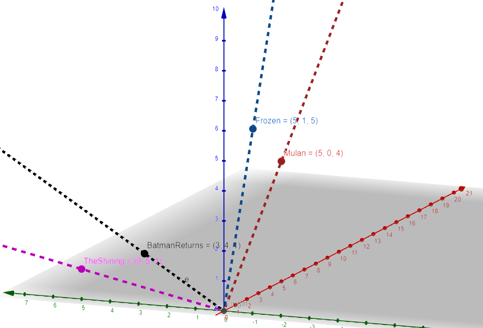

- [Problem Statement](#Problem-Statement)
- [Summary](#Summary)
- [Next Steps](#Next-Steps)
- [Data Dictionary](#Data-Dictionary)
- [External Resources](#External-Resources)

---

## Problem Statement

Recommendation systems are ubiquitous in today's attention-driven online environment, whether used by an online retailer to recommend similar products or a media application to prompt binge-watching. These systems use a combination of well known and proprietary techniques to engage customers with customized recommendations based on their previous preference. In this project, I created a relatively simple version of one of these recommenders using customer reviews between 1995-2015 provided by Amazon. I specifically looked at products in the categories of books, movies, and video games. To reflect the narrative element in each of these products, I titled my project "Nextale". As a unique feature, I also added an exclusion search box so that a user can filter their recommendations even further by removing results in which they're personally disinterested. It is a tool to assist the user in finding their "next tale" based on something they enjoyed previously.

---

## Summary

My first task in undertaking this project was finding a suitable volume and breadth of information commensurate with my goal. This presented itself in the form of the "Amazon Customer Review Dataset" provided by Amazon Web Services. There are reportedly over 130 million reviews available, but as stated above I limited the scope of my project to three segments - books, movies, and video games. I wrote a custom function to automatically clean / organize the initial raw file and re-save it. Among other processes, this function dropped null values (representing less than 1% of all data), unused columns, and any item with less than 10 reviews. It also concatenated the review title and review text into one string, and then tokenized, lemmatized, and removed-stop-words from that combined review text so that the remainder was ripe for NLP. Upon completion, I had 1,489,354 book reviews, 4,405,432 movie reviews, and 1,648,136 video game reviews all together containing over 3.5 million unique customers and more than 133,000 products.

Having cleaned the review data, I set out to create a cosine distance recommender model. This model finds the similarity between products by measuring the angle between their vectors created from review grades by customers. Here is an example of what the initial reviewer by product matrix looked like on a small scale (with artificial ratings):

| Movie          |   user_1 |   user_2 |   user_3 |
|:---------------|---------:|---------:|---------:|
| Batman Returns |        3 |        4 |        1 |
| Frozen         |        5 |        1 |        5 |
| Mulan          |        5 |        0 |        4 |
| The Shining    |        0 |        5 |        1 |

We can see here that the vector created from the ratings of Batman Returns is [3,4,1] and the vector of Frozen will be [5,1,5]. These vectors are like lines pointing out from the same origin point. The more similar the contents are, the more similar the direction in which they point. The cosine distance (angle) between these lines will be a measure between 0 and 1 where 0 (no distance) means they are identical and 1 means no relationship. Here's an image that represents those vectors:

We see that Frozen and Mulan are on very similar trajectories and the angle between them is small. Contrastingly, The Shining is pointing in quite a different direction, with Batman Returns somewhere in between. Here is what that distance looks like numerically - the number in each cell represents the pairwise distance between items.

|                |   Batman Returns |   Frozen |   Mulan |   The Shining |
|:---------------|-----------------:|---------:|--------:|--------------:|
| Batman Returns |             0    |     0.34 |    0.42 |          0.19 |
| Frozen         |             0.34 |     0    |    0.02 |          0.73 |
| Mulan          |             0.42 |     0.02 |    0    |          0.88 |
| The Shining    |             0.19 |     0.73 |    0.88 |          0    |

As we might expect, the distance between each film and itself is 0 (along the diagonal)! By selecting a product and sorting the numerical contents of that product's column from least to greatest, we can predict similarity between items. For example:

|                |   Frozen |
|:---------------|---------:|
| Frozen         |     0    |
| Mulan          |     0.02 |
| Batman Returns |     0.34 |
| The Shining    |     0.73 |

Obviously Frozen's best match is with itself... after that we would recommend Mulan, then Batman Returns, then The Shining, which intuitively is probably the order we would expect. My recommender works just like this, but in a few more than 3 dimensions!

One potential hurdle in deploying this form of recommender is if a reviewr has made more than one review for the same product. While this represented a relatively small proportion of my total reviews, I am generally reluctant to remove data if there is some way to salvage it and use it. In my exploration, I found that some of these reviews were simply duplicates (the reviewer presumably revisited the "submit" button in quick and aggressive fashion following their entry), but others were people who had one initial reaction and then later returned to give a second opinion after more evaluation. Without having the time or desire to examine each one of these instances individually, I settled upon sorting them by date and keeping the most recent entry. For customers who accidentally submitted their review multiple times at the same instant, any one of them would be a fair enough representation of their opinion, and for those who made an initial and then subsequent contribution, their final opinion would be the one that counted.

Again, I wrote a custom python function to transform the initial pandas dataframe of review information into a recommender matrix. The final output was a product x product dataframe with the numbers inside representing the cosine distance between the respective products. A "0" would be where a product interescted with itself, and a 1 would be where two products had no relationship whatsoever. These recommender dataframes initially presented a memory challenge - for example, the largest (movies) is over 72,000 x 72,000 or over 5,184,000,000 cells! This initially took up over 40 GB of space, much more than I could hope to hold in memory at one time. I overcame this obstacle by encoding a "sparse" transformer into my python function. By default, the sparse representation tells python not to save any zeroes to memory - this is helpful when the majority of a large dataframe contents are zeroes. By not storing those integers, a significant amount of memory is saved and as long as all *other* values are tangible, we (and python) can infer that any "empty" values would be zeroes. I realized, however, that the majority of my recommender dataframe's contents were, in fact, "1"s. With such a large volume of products, most would be unrelated to each other because they would not share a common reviewer. With that in mind, I adjusted the sparse function to not remember any of the 1's in my dataframe. This cut my over 40 GB dataframe to less than 2 GB!

With all three product x product dataframes created, I was finally able to make recommendations! I built a large function that accepted paramaters for category, search term, and (optional) filter-out term, and returned the top 10 most similar items, as well as those items' total number of reviews and average star rating. Making use of the NLP framework I set up when cleaning, I also pulled out the five most common recurring terms in reviews for each item and returned those as well, to give users another angle from which to perceive the aggregate opinions of reviewers with regards to the recommended items.

Not content with having a model that only ran in my Jupyter notebook, I set a stretch goal of deploying my recommender online for others to experience it. After experimenting with Flask, I settled on the popular streamlit.io python module. This allowed me to create a clean yet modern-looking web app without requiring the html/css knowledge that Flask would to achieve a similarly polished look.

The largest recurring challenge that I encountered during this web deployment phase was simply the size of my data. Each of the three categories requrired two dataframes: a "lookup" dataframe to run the search query through and return information about products (number of reviews, average star rating), and a "recommender" dataframe which was my aforementioned product x product matrix. In total, this meant I had to read in six dataframes, the largest of which was still almost 2 GB. So while my recommender app worked, it was tediously slow.

To overcome this, I used my recommender systems to create dictionaries which stored the top 50 most similar products to each other product. For example, my 72k x 72k product dataframe became a dictionary with 72k entries, each having a list of 50 titles associated with it. The potential downside to this method was that with only 50 similar items, there was always a theoretical possibility that one of the "filter-out" keywords a user entered might apply to more than 90 of the returned products, leaving the recommender with less than 10 items to recommend. In practice, I was unable to trigger this sort of error and hopefully no one ever does! The upside, however, far outweighed the potential downside, in the sense that my search returns became reliably rapid.

Check it out for yourself!

[Nextale App - hosted by Streamlit](https://share.streamlit.io/griffinwt/nextale/main/Nextale_Streamlit.py)

*A note on the myriad jupyter notebooks connected to this project - in most cases I did my preliminary data wrangling on the video game set because it was the smallest, and then used what I learned to build functions that I applied to the larger movie and video game sets. This means that most of my work, particularly in the "Cleaning" and "EDA" files is going to be shown in the video game related notebooks.*

---

## Next Steps

- My search mechanism is still fairly rudimentary - I'd like to make it more exact, either by adding keyword searches (perhaps over the review text) or even providing a drop down that offers suggestions of products as users type; I'd also to like to add additional parameters like genre or author/actor/game company to help users refine their searches
- Because I used a systematic, function-based approach, my cleaning and recommender creation processes would easily generalize to other categories of the Amazon Review dataset. With more time and less memory constraints, I could easily expand my recommender to encompass other types of goods
- The Natural Language Processing I performed in this project was somewhat shallow as it only contributed to a tangental feature; with more time, I believe I could glean greater insights comparing user review text, combining it either by star rating, product, average product star rating, or by similar products; I'd also be interested in building a classifier to see how accurately I could predict verified purchases based on review text
- As the common refrain goes, more data would always be better! My model would be more robust if I had the opportunity to add more recent reviews (post-2015) to expand it in both product range and total review volume

---

## Data Dictionary

|Feature|Type|Description|
|---|---|---|
|**customer_id**|int|unique customer identifier|
|**review_id**|str|unique review identifier|
|**product_id**|str|unique product identifier|
|**product_parent**|int|identifier to group reviews of the same product|
|**product_title**|str|listed name of product|
|**star_rating**|int|reviewer's score of product - scale 1-5|
|**helpful_votes**|int|count of people who rated the review as being helpful|
|**total_votes**|int|number of total votes on a review|
|**verified purchase**|int|binary classifier: 1 if reviewer purchased item, 0 if unverified|
|**review_date**|date-time|date of review|
|**full_review**|str|tokenized/lemmatized/stop-words-removed concatenation of review title and review text|

---

### External Resources
https://s3.amazonaws.com/amazon-reviews-pds/readme.html

